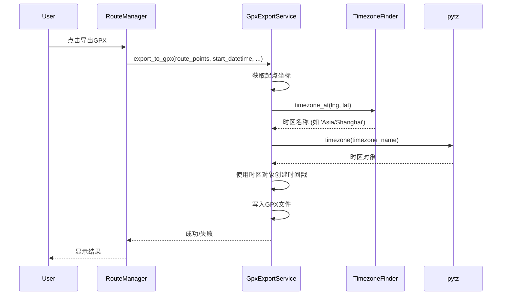

# 设计文档

## 概述

本设计为GPX导出服务添加时区感知功能。系统将使用timezonefinder库根据路线起点坐标检测时区，然后使用pytz库将该时区应用到所有轨迹点的时间戳。如果时区检测失败，系统将优雅地回退到UTC时区，确保导出操作始终成功。

## 架构

### 高层架构

```
用户点击"导出GPX"
    ↓
RouteManager.export_gpx()
    ↓
GpxExportService.export_to_gpx()
    ↓
1. 获取起点坐标
2. 检测时区 (TimezoneFinder)
3. 创建时区感知的datetime (pytz)
4. 为每个轨迹点生成带时区的时间戳
5. 写入GPX文件
```

### 组件交互



## 组件和接口

### 1. GpxExportService (修改)

**职责:**
- 检测路线起点的时区
- 创建带时区信息的datetime对象
- 为每个轨迹点生成带时区的时间戳
- 处理时区检测失败的情况

**新增方法:**

```python
def _detect_timezone(self, latitude: float, longitude: float) -> timezone:
    """
    根据坐标检测时区

    Args:
        latitude: 纬度
        longitude: 经度

    Returns:
        timezone: pytz时区对象，失败时返回UTC
    """
```

**修改方法:**

```python
def export_to_gpx(self, route_points, start_datetime, file_path,
                  start_name=None, end_name=None) -> bool:
    """
    导出路线为GPX文件（添加时区支持）

    修改内容:
    1. 在开始时检测起点时区
    2. 使用检测到的时区创建datetime对象
    3. 所有轨迹点使用相同的时区
    """
```

### 2. TimezoneFinder集成

**库:** timezonefinder
**用途:** 将地理坐标映射到IANA时区标识符

**使用方式:**
```python
from timezonefinder import TimezoneFinder

tf = TimezoneFinder()
timezone_name = tf.timezone_at(lng=longitude, lat=latitude)
# 返回: 'Asia/Shanghai', 'America/New_York', 等
```

### 3. pytz集成

**库:** pytz
**用途:** 处理时区转换和创建时区感知的datetime对象

**使用方式:**
```python
import pytz
from datetime import datetime

# 获取时区对象
tz = pytz.timezone('Asia/Shanghai')

# 创建时区感知的datetime
naive_dt = datetime(2024, 1, 1, 12, 0, 0)
aware_dt = tz.localize(naive_dt)
# 结果: 2024-01-01 12:00:00+08:00
```

## 数据模型

### 时区检测流程

```python
# 输入
route_points = [(lat1, lon1), (lat2, lon2), ...]
start_datetime = QDateTime对象

# 处理
1. 提取起点: first_point = route_points中第一个非None的点
2. 检测时区: timezone_name = TimezoneFinder().timezone_at(lng=lon1, lat=lat1)
3. 创建时区对象: tz = pytz.timezone(timezone_name) if timezone_name else pytz.UTC
4. 转换起始时间: aware_datetime = tz.localize(naive_datetime)

# 输出
每个GPXTrackPoint的time字段包含时区信息
格式: 2024-01-15T12:00:00+08:00 (ISO 8601)
```

### GPX时间戳格式

**当前格式 (UTC):**
```xml
<time>2024-01-15T04:00:00Z</time>
```

**新格式 (带时区):**
```xml
<time>2024-01-15T12:00:00+08:00</time>
```

## 正确性属性

*属性是关于系统应该做什么的特征或行为，应该在所有有效执行中保持为真。属性是人类可读规范和机器可验证正确性保证之间的桥梁。*


### 属性 1: 时区检测使用起点坐标

*对于任何*有效的路线点列表，当导出GPX时，系统应该使用第一个非None路线点的坐标来检测时区。

**验证: 需求 1.1, 1.2**

### 属性 2: 时间戳包含正确的时区信息

*对于任何*导出的GPX文件，所有轨迹点的时间戳应该包含时区信息且符合ISO 8601格式（格式为YYYY-MM-DDTHH:MM:SS±HH:MM或Z）。

**验证: 需求 2.1, 2.2, 2.4**

### 属性 3: 时区信息一致性

*对于任何*导出的GPX文件，所有轨迹点应该使用相同的时区偏移。

**验证: 需求 2.3**

### 属性 4: 时区检测失败时回退到UTC

*对于任何*时区检测失败的情况，系统应该回退到UTC时区，记录警告日志，并成功完成导出操作。

**验证: 需求 4.1, 4.2, 4.4**

### 属性 5: 文件结构向后兼容

*对于任何*路线，新旧版本导出的GPX文件应该具有相同的结构（轨迹、段、元数据），仅在时间戳的时区表示上有所不同。

**验证: 需求 5.2, 5.3**

## 错误处理

### 时区检测失败场景

1. **TimezoneFinder返回None**
   - 原因: 坐标位于海洋或未映射区域
   - 处理: 使用UTC时区
   - 日志: WARNING级别，记录坐标

2. **TimezoneFinder库不可用**
   - 原因: 库未安装或导入失败
   - 处理: 使用UTC时区
   - 日志: WARNING级别，记录异常信息

3. **pytz时区创建失败**
   - 原因: 无效的时区名称
   - 处理: 使用UTC时区
   - 日志: WARNING级别，记录时区名称

4. **起点坐标无效**
   - 原因: route_points为空或全为None
   - 处理: 使用UTC时区
   - 日志: WARNING级别

### 错误处理策略

```python
def _detect_timezone(self, latitude: float, longitude: float) -> timezone:
    """检测时区，失败时返回UTC"""
    try:
        # 尝试导入库
        from timezonefinder import TimezoneFinder
        import pytz

        # 查找时区
        tf = TimezoneFinder()
        timezone_name = tf.timezone_at(lng=longitude, lat=latitude)

        if timezone_name:
            self.log("INFO", f"检测到时区: {timezone_name}")
            return pytz.timezone(timezone_name)
        else:
            self.log("WARNING", f"坐标 ({latitude}, {longitude}) 未找到时区，使用UTC")
            return pytz.UTC

    except ImportError as e:
        self.log("WARNING", f"时区库不可用: {e}，使用UTC")
        return pytz.UTC
    except Exception as e:
        self.log("WARNING", f"时区检测失败: {e}，使用UTC")
        return pytz.UTC
```

## 测试策略

### 双重测试方法

本功能将使用单元测试和基于属性的测试相结合的方法：

**单元测试:**
- 测试特定示例和边缘情况
- 测试错误条件（库不可用、无效坐标）
- 测试与现有功能的集成
- 验证日志记录

**基于属性的测试:**
- 验证时区检测对所有有效坐标的正确性
- 验证时间戳格式对所有轨迹点的一致性
- 验证错误回退对所有失败场景的鲁棒性
- 每个属性测试至少运行100次迭代

### 测试配置

**属性测试库:** Python的hypothesis库
**最小迭代次数:** 100次/属性
**标签格式:** `# Feature: gpx-timezone-export, Property {number}: {property_text}`

### 具体测试场景

**单元测试场景:**
1. 测试北京坐标 (39.9042, 116.4074) 返回 'Asia/Shanghai'
2. 测试纽约坐标 (40.7128, -74.0060) 返回 'America/New_York'
3. 测试海洋坐标返回UTC
4. 测试TimezoneFinder不可用时回退到UTC
5. 测试空路线点列表使用UTC
6. 测试导出的GPX文件可以被标准GPX解析器解析
7. 测试时间戳格式符合ISO 8601

**属性测试场景:**
1. 对于任何有效路线，时区检测应该使用第一个点
2. 对于任何导出，所有时间戳应该包含时区信息
3. 对于任何导出，所有时间戳应该使用相同的时区
4. 对于任何时区检测失败，导出应该成功完成
5. 对于任何路线，文件结构应该保持一致

### 测试数据生成

使用hypothesis生成测试数据：
```python
from hypothesis import given, strategies as st

# 生成有效的经纬度坐标
@st.composite
def coordinates(draw):
    lat = draw(st.floats(min_value=-90, max_value=90))
    lon = draw(st.floats(min_value=-180, max_value=180))
    return (lat, lon)

# 生成路线点列表
@st.composite
def route_points(draw):
    num_points = draw(st.integers(min_value=2, max_value=100))
    points = [draw(coordinates()) for _ in range(num_points)]
    return points
```

## 实现细节

### 依赖项更新

需要在requirements.txt中添加：
```
timezonefinder>=6.0.0
pytz>=2024.1
```

### 代码修改位置

**主要修改文件:**
- `src/modules/gpx/gpx_export.py` - 添加时区检测和应用逻辑

**测试文件:**
- `src/tests/unit/modules/gpx/test_gpx_export.py` - 添加单元测试
- `src/tests/unit/modules/gpx/test_gpx_export_timezone.py` - 新建属性测试文件

### 实现步骤

1. 添加依赖项到requirements.txt
2. 实现`_detect_timezone()`方法
3. 修改`export_to_gpx()`方法以使用检测到的时区
4. 添加错误处理和日志记录
5. 编写单元测试
6. 编写属性测试
7. 运行现有测试确保向后兼容性
8. 手动测试不同地区的路线导出

### 性能考虑

- TimezoneFinder首次使用时会加载数据文件（约50MB），后续查询很快
- 考虑在GpxExportService初始化时创建TimezoneFinder实例以复用
- 单次时区查询通常在1-5ms内完成
- 对导出性能的影响可忽略不计（相比文件I/O）

### 兼容性说明

- 导出的GPX文件符合GPX 1.1标准
- 带时区的时间戳与所有主流GPS设备和应用兼容
- 现有不带时区的GPX文件仍然可以正常导入和处理
- 用户无需任何配置更改即可使用新功能
